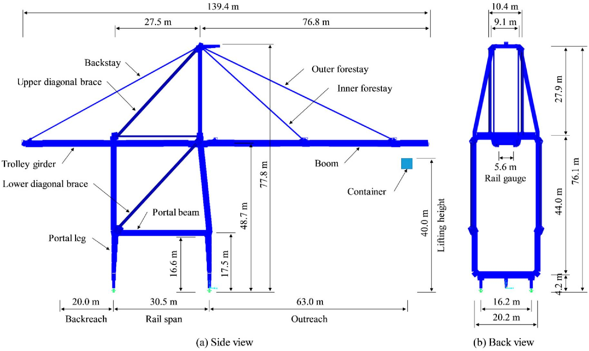

# Dimensions

## World Properties
- Water
  - Position:
    - Y = 195
- Shore
  - Position:
    - Y = 200

## Objects
- Rails
  - Position
    - X = 1000
    - Y = 200
    - Z = 1000
  - Dimensions
    - width = 30.5
    - Depth = 1000
- Container
  - ?

## Components
- Gantry
  - Dimension:
    - Height = 77.8
    - Width = 16.2
    - Depth = 30.5
  - Parent component = Rails
  - Start absolute position
    - X = 1000
    - Y = 200
    - Z = 1000
  - Relative start position: 
    - Place of start position = left back
    - Z = 0
  - Relative end position (determent by depth of rails - depth of Gantry)
    - Z = 983.8
- Boom
  - Dimension:
    - Height = -
    - Width = 5.6
    - Depth = 113.5
  - Parent component = Gantry
  - Start absolute position
    - X = 980.0
    - Y = 248.7
    - Z = 1004.1
  - Relative start position: 
    - Place of start position = back center of outreach
    - x = 0
  - Relative end position:
    - x = 113.5
- Trolley
  - Dimension:
    - Height = -
    - Width = 5.6
    - Depth = -
  - Parent component = Boom
  - Start absolute position:
    - X = 980.0
    - Y = 240.0
    - Z = 1004.1
  - Relative start position: 
    - Place of start position = center back of boom rails
    - x = 0
  - Relative end position:
    - x = 113.5
- Hoist
  - Dimension:
    - Height = -
    - Width = -
    - Depth = -
  - Parent component = Trolley
  - Start absolute position
    - X = 980.0
    - Y = 240.0
    - Z = 1004.1
  - Relative start position: 
    - Place of start position = 
    - Y = 0
  - Relative end position:
    - Y = 40
- Spreader
 - Dimension:
    - Height = -
    - Width = -
    - Depth = -
  - Parent component = Hoist
  - Start absolute position:
    - X = 980.0
    - Y = 240.0
    - Z = 1004.1
  - Relative start position: 
    - Place of start position = center trolley
    - Y = 60 (absolute = 240)
  - Relative end position:
    - Y = 0  (absolute = 180)
